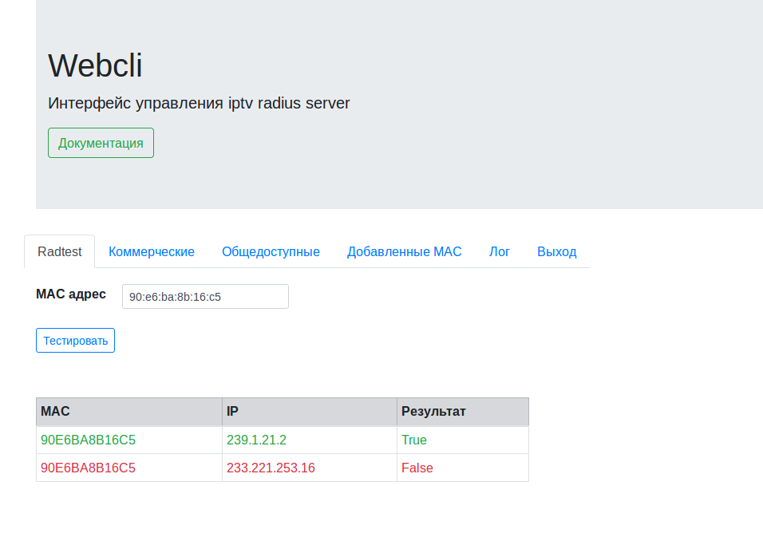
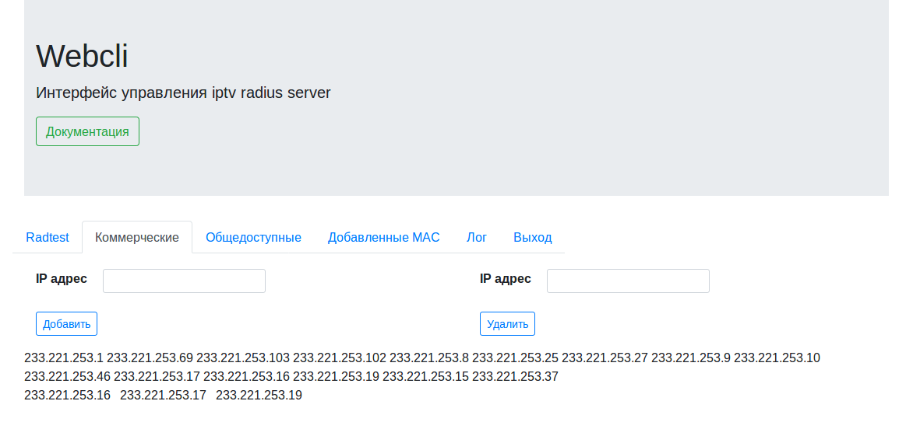
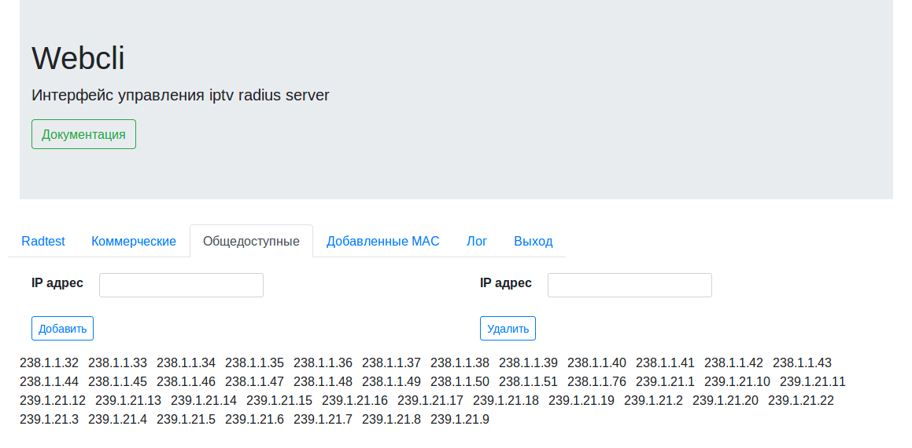
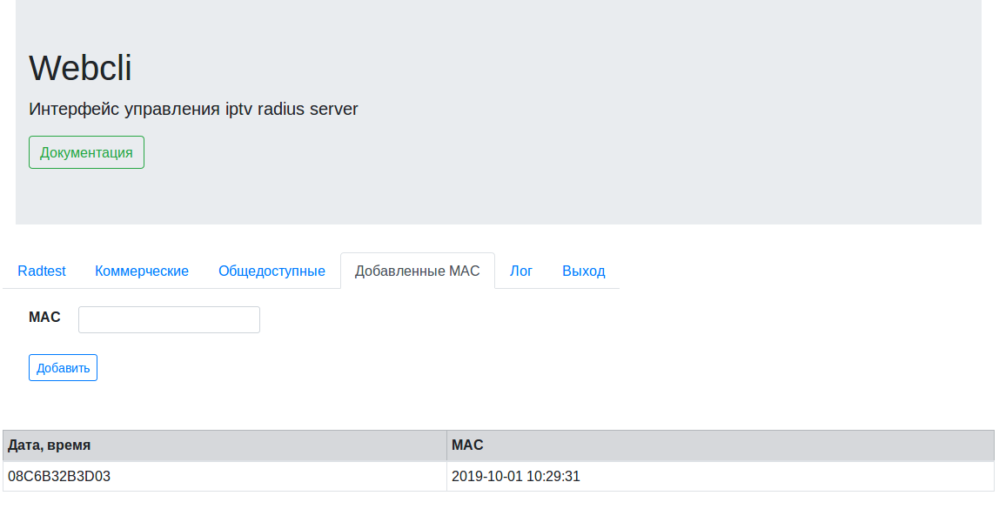

## Web Клиент для сервера iptv radius server

**radtest** - тестирование radius сервера

**Коммерческие** - просмотр списка, добавление, удаление ip адресов коммерческих каналов.

**Общедоступные** - просмотр списка, добавление, удаление ip адресов общедоступных каналов.

**Добавленные MAC** - просмотр списка, добавление временно действующих MAC адресов.
За подчистку старых MAC адресов отвечает другой процесс (oracli).

Взаимодействие с mysql: python-mysqldb

